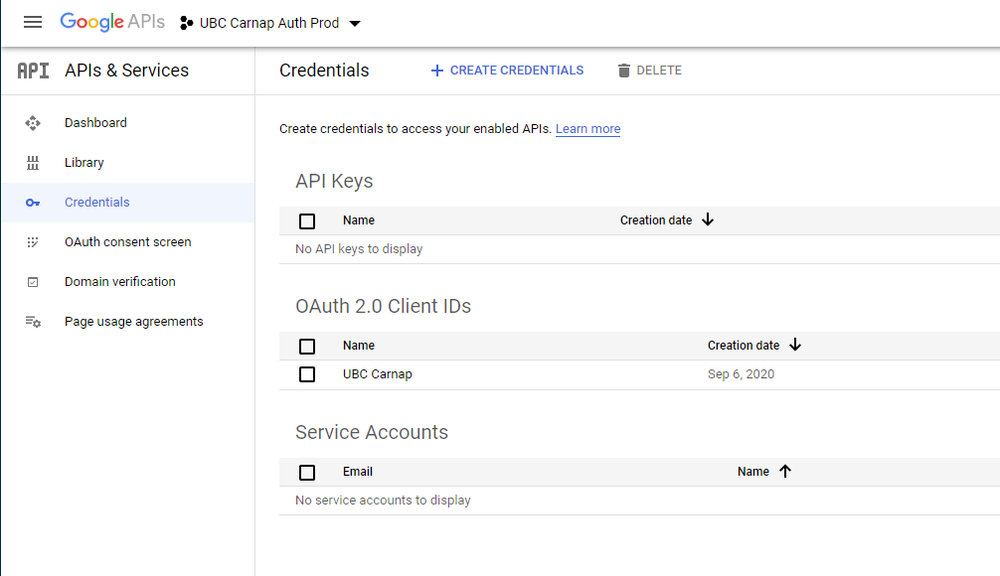
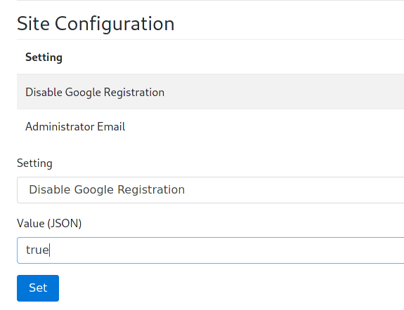

# Carnap deployment and administration

## General information

The build infrastructure around Carnap supports two deployment modes: Stack
builds for use with the Keter web server on traditional Linux servers and Nix
builds for use on Docker or NixOS servers. Stack with Keter is used on
Carnap.io. An experimental prebuilt [Docker image](#Docker) is available.

If you would like to build Carnap yourself using Nix directly, see the
[development README](https://github.com/Carnap/Carnap).

We provide Nix packaging as the `server` attribute returned by `default.nix`
for use in NixOS and NixOps.

If you wish to work with Carnap's Nix infrastructure outside the Docker images,
it is highly recommended to use Cachix to avoid having to build
anything that our Continuous Integration has already built.

## Requirements

* PostgreSQL database with a user (TODO: which privileges do they need on their
  database?)
* Writable persistent directory to give as the `dataroot`
* Google API key (see below for information on how to configure it)

## Server setup

### Settings file

Carnap uses a settings file, `settings.yml`, to store its configuration. You
can find the example version at [`Carnap-Server/config/settings-example.yml`][settings-example]

The version in `Carnap-Server/config/settings.yml` is bundled within the
executable. To utilize binary caching, Nix builds directly use the example
configuration file, and users are expected to use environment variables or
provide a different YAML file at runtime.

You can provide a different settings file at runtime by passing it as the first
argument to the `Carnap-Server` executable. Also, all settings are configurable
by environment variables, which is useful for Docker deployments (see the
example configuration for a list of these settings).

[settings-example]: https://github.com/Carnap/Carnap/blob/master/Carnap-Server/config/settings-example.yml

### `dataroot`

Carnap requires a writable `dataroot`, configured with the `DATAROOT`
environment variable, to store documents and the cookie encryption key in.

This directory can also contain a subdirectory `srv`, whose contents are
directly available at `/srv/` on the Carnap instance. This is used for
documentation on the production instance at `carnap.io`.

### Database

Due to a [bug that breaks migrations on SQLite][bug] in our database library,
production deployments of Carnap should use PostgreSQL databases. Set the
environment variable `SQLITE=false` and supply `PGUSER`, `PGPASS`, `PGHOST`,
and if required, `PGPORT` and `PGDATABASE` for your PostgreSQL database
instance.

If you wish to use peer authentication via Unix socket on a locally hosted
PostgreSQL database, set all of `PGUSER`, `PGPASS`, `PGHOST` and `PGPORT` to
empty strings.

[bug]: https://github.com/yesodweb/persistent/issues/1125

### NixOps

The Carnap team at UBC uses [NixOps](https://github.com/NixOS/nixops) to
automatically deploy Carnap on [DigitalOcean](https://www.digitalocean.com/)
servers running NixOS. It's currently experimental and documentation is a
work-in-progress, but [the configuration
files](https://github.com/ubc-carnap-team/carnap-nixops) are public.

### Docker

There is experimental Docker support for Carnap. Images are available via the
GitHub container registry at `ghcr.io/carnap/carnap/carnap:latest`.

There is a sample docker-compose environment with automatically-managed
[Caddy][caddy] based HTTPS termination, the recommended PostgreSQL database,
and full setup instructions [available in the Carnap documentation repository
here][env].

Docker configuration details

Carnap in Docker can most effectively be configured with environment variables.
See the [example settings file][settings-example] for a list. A volume should
be provided at `/data` for persistent data such as documents.

At minimum, the following environment variables must be configured:

- `APPROOT`
- `GOOGLEKEY`
- `GOOGLESECRET`

[caddy]: https://caddyserver.com
[env]: https://github.com/Carnap/Carnap-Documentation/tree/master/docker-compose-sample

## Authentication

Two authentication schemes are supported by Carnap, both of which require some
configuration. Production Carnap deployments currently require Google
authentication to be configured for administration purposes, even if it is not
intended to be used by students.

See the [LTI 1.3 documentation](lti.md) for details on how to configure that
system after [completing setup](#post-installation-first-time-setup).

### Google authentication

Setting up Google authentication requires setting up a Google APIs project.

First, create the project: https://console.developers.google.com/cloud-resource-manager

Then, create an OAuth2 client ID: https://console.developers.google.com/apis/credentials

It will show up like this:

On the client ID page, set an Authorized Redirect URI for `https://YOURDOMAINHERE/auth/page/google/callback`:

On your OAuth2 Consent Screen tab, no scopes need to be added as Carnap just
needs emails to log in.

Once you've configured all the information on the Google side, fill it in the
Carnap configuration file or environment variables:

* `google-api-key`/`GOOGLEKEY`: your Google Client ID
* `google-secret`/`GOOGLESECRET`: your Google Client secret

## Post installation first-time setup

### Becoming administrator

Go to your newly minted Carnap instance and log in with Google. Enter your name
and register. Then, go to `https://YOURDOMAINHERE/admin_promote` and click the
button. You will now be the administrator of this instance. Multiple
administrators are supported (with manual database editing), but there is not
yet user interface to enable this.

You can manage the site including promoting instructors, managing students, and
configuring LTI platforms at `https://YOURDOMAINHERE/master_admin`.

### Once you're an administrator

After you have become administrator, check the following items on the
`master_admin` page:

1. Ask anyone who needs to be instructor to log in and register, then promote
   them to instructor.

2. If you don't want to allow further Google registrations (if you intend to
   use LTI with your learning management system for student login, setting this
   option is recommended), enter `true` for "Disable Google Registration" under
   the "Site Configuration" heading:

   

   Anyone who has logged in already with Google can still log in, but new
   registrations will be prevented.

   This can be disabled temporarily at any time if more instructors need to be
   added.

3. Configure login with LTI 1.3 compatible learning management systems [using
   the LTI guide](./lti.md).
