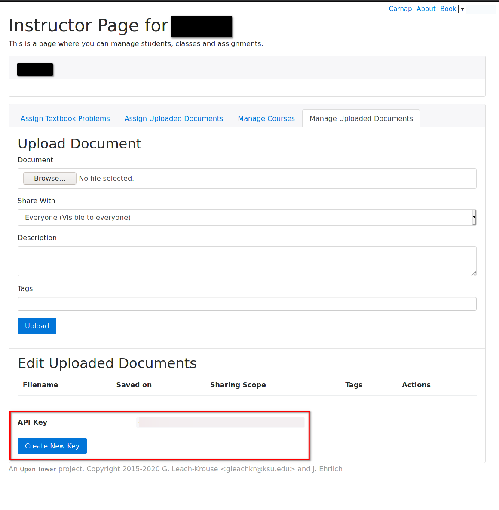

<style>
h4 {
    padding-top: 1em;
    padding-bottom: .3em;
    border-bottom: 1.5px solid #aaa;
}

h2 {
    margin-bottom: .5em;
}

pre.sourceCode {
    background-color: #f8f8f8;
}

article img {
    max-width: 100%;
}
</style>

# Carnap API

Carnap has an experimental API, which is currently under development (see the
tracking issues below).

## Tracking issues

* [Issue #226 "Perform instructor actions via an API"](https://github.com/Carnap/Carnap/issues/226)
* [Issue #231 "Documents API"](https://github.com/Carnap/Carnap/issues/231)
* [Issue #230 "Copy course"](https://github.com/Carnap/Carnap/issues/230)

## Instructor setup

To use the API, you need an API key. Your API key should be kept a secret,
since it allows anyone who has it to access and modify your courses.

You can create an API key for yourself on the instructor page, beneath the
"Manage Uploaded Documents" tab, here:



## Usage

### Example Scripts

Here are some examples for how you can get into a position to start using the
API with different programming languages. We assume that you're testing, so the
URL begins with `http://localhost:3000`. This should instead be
`https://YOURSERVERRDOMAIN` when you're using this with a non-local server

#### Python

Create the file `apitest.py`:

```python
import requests

apikey = 'REDACTED'

base = 'http://localhost:3000/api/v1'

def rq(meth, p, *args, key=apikey, **kwargs):
    h = {
        'X-API-KEY': key,
    }
    return requests.request(meth, base + p, *args, **kwargs, headers=h)
```

To issue the commands displayed below interactively `ipython -i apitest.py`, or
`python -i apitest.py`.

#### Bash

Just use `curl` as indicated below.

## Available API Methods

### Document API

All of the methods in the documents API require that `:instructorIdent` is
the same as the user who owns the API key (i.e. they do not work on other
users' documents yet).

[Tracking issue](https://github.com/Carnap/Carnap/issues/231)

#### GET `/instructors/:instructorIdent/documents`

<details> <summary> Retrieves a list of documents owned by the given instructor
and their metadata. </summary>

Here are some example commands:

*Python*

```python
rq('GET', '/instructors/yourname@gmail.com/documents').json()
```

*Bash*

```bash
curl -H "X-API-KEY:YOURAPIKEYHERE" localhost:3000/api/v1/instructors/yourname@youremail.com/documents
```

**Result**

And here's what your result will look like:

```python
[{'creator': 1,
  'date': '2021-02-16T09:41:39.445672522Z',
  'scope': 'Public',
  'id': 1,
  'description': None,
  'filename': 'api.md'}]
``` 

</details>

#### POST `/instructors/:instructorIdent/documents`

<details> <summary> Creates a new document with empty contents. </summary>

Should be followed by a `PUT` at
`/instructors/:instructorIdent/documents/:documentId/data` in order to fill in
the document contents.

*Python*

```python
rq('POST', '/instructors/yourname@gmail.com/documents',
    json={
        "filename": "myfile.md",
        "scope": "Private",
        "description": "My file",
    }
).json()
```

*Bash*

```bash
curl -H "X-API-KEY:YOURAPIKEY" \
     -H "Content-Type: application/json" \
     -d '{"filename":"myfile.md","scope":"Private", "description":"My file"}' \
     localhost:3000/api/v1/instructors/yourname@gmail.com/documents
```

**Result**

```json
3
```

or an error is returned as an encoded JSON string.

The response will also include a `Location` header pointed at the new resource.
`scope` indicates the sharing scope of the document, and can be one of
`Private`, `Public`, `LinkOnly` or `InstructorsOnly`. Both the scope and
description fields can be omitted, with scope defaulting to `Private`.

</details>

#### GET `/instructors/:instructorIdent/documents/:documentId`

<details><summary> Like GET `/instructors/:instructorIdent/documents` but for a
single document. </summary>

*Python*

```python
rq('GET', '/instructors/yourname@gmail.com/documents/1').json()
```

*Bash*

```bash 
curl -H "X-API-KEY:YOURAPIKEYHERE" localhost:3000/api/v1/instructors/yourname@youremail.com/documents/1
```

**Result**

```python
{'creator': 1,
 'date': '2021-02-16T09:41:39.445672522Z',
 'scope': 'Public',
 'description': None,
 'filename': 'api.md'}
```

</details>

#### PATCH `/instructors/:instructorIdent/documents/:documentId`

<details><summary>Updates the metadata for a single document.</summary>

*Python*

```python
rq('PATCH', '/instructors/yourname@gmail.com/documents/1',
    json={"scope": "Private"}).json()
```

*Bash*

```bash 
curl -H "X-API-KEY:YOURAPIKEY" -X "PATCH" -d '{"scope":"Public"}' \
     localhost:3000/api/v1/instructors/yourname@youremail.com/documents/1
```

**Result**
```python
{'creator': 1,
 'date': '2021-02-16T09:41:39.445672522Z',
 'scope': 'Private',
 'description': None,
 'filename': 'api.md'}
```

Currently `scope` and `description` fields can be updated. Passing in a null
value for `description` will cause the document description to be cleared
entirely.

</details>

#### GET `/instructors/:instructorIdent/documents/:documentId/data`

<details><summary>Gets the content of the given document by ID and returns
it.</summary>

*Python*

```python
rq('GET', 'instructors/yourname@youremail.com/documents/1/data').text
```

*Bash*

```bash 
curl -H "X-API-KEY:YOURAPIKEYHERE" \
     localhost:3000/api/v1/instructors/yourname@youremail.com/documents/1/data
```

**Result**

The contents of your document, as text

</details>

#### PUT `/instructors/:instructorIdent/documents/:documentId/data`

<details><summary> Overwrites the content of the given document by ID.</summary> 

These examples use "aaaaaa" as a thing you might insert as the document
contents.

*Python*

```python
rq('PUT', '/instructors/yourname@gmail.com/documents/1/data', data='aaaaaa')
```

*Bash*

```python
echo aaaaaa | curl -H "X-API-KEY:YOURAPIKEYHERE"  -T "-" \
    localhost:3000/api/v1/instructors/gleachkr@gmail.com/documents/1940/data
```

**Result**

```python
<Response [200]>
```

</details>
