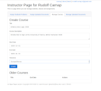
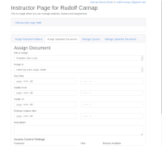
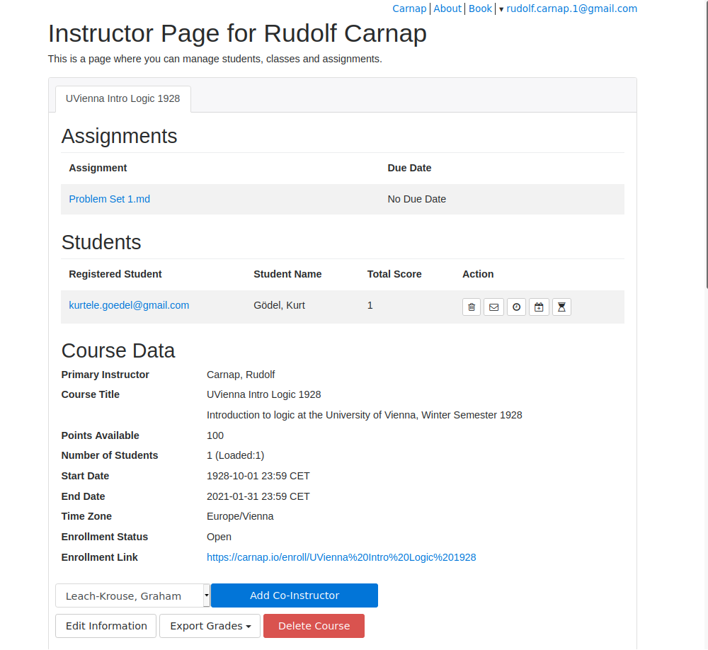

# Carnap's Course Management Dashboard

This document gives a short description of the Carnap server's
course-management dashboard.

The course management dashboard will be available once you have

1.  *Created a user account*. 

    To do this, just click the [login link](/auth/login) located in the upper
    right hand corner of most Carnap pages.

2.  *Upgraded your account status to "instructor"*. 

    To do this, email Graham Leach-Krouse at [gleachkr@ksu.edu](mailto:gleachkr@ksu.edu) 
    using your institutional email address.

Once you are logged in, you'll then be able to access the course management
dashboard by first,

1. navigating to your user page, following the link to *Instructor
   Home* in the menu linked to your email address in the top right
   corner of most pages; then
2. from your user page, clicking the link at the very top that reads "your
   instructor page is here"

You should then see the course management dashboard. The dashboard has
two main parts: The *course card*, where information for your
different courses is listed, and the *assignment card*, where you can
assign problem sets from the [Carnap Book](/book).[^1] If this is your
first time on the instructor page, your course card is probably empty.
So we'll describe the assignment card first.

[^1]: I concede that tabbed cards are not the best UI metaphor. I'm open to
suggestions on this one.

## The Assignment Card

The top of the assignment card looks like this:

There are four main tabs. The first one you want to look at is
probably "Manage Courses".

### Manage Courses

Within this tab, you can create a new course, by giving it a title, an
optional description, a start-date, a total number of available points
for the course, an end-date, and a time-zone. The time zone which is
used to determine whether assignments have been received by a given
due date and time. The start-date and end-date are used to determine
when your course will be listed as an option for enrollment.

Once you've created a course, during the period between the start date
and end date, it will:

1. be visible as an enrollment option for people creating new
   accounts, or for people editing their user information from their
   user pages;
2. become visible to you as a target for assignments in the other tabs; and
3. appear as a tab in your course card (see below).

After the end-date of the course, the course will be archived at the
bottom of the manage-courses tab, under the heading "Old Courses".
Once the course is archived, you'll still be able to edit the course's
properties, download grades as a `.csv` file, and delete the course.
If you need to reactivate an archived course, just set its end-date
for some point in the future.

### Assign Textbook Problems

Within this tab, you can assign textbook problem sets from the Carnap
book to your courses, setting particular due-dates and due-times.
There are currently 17 problem sets available, but more are likely to
appear in the future. Once a problem set is assigned to a given
course, it will appear on the user-page of everyone enrolled in that
course.

You can also delete assigned problem sets, and replace them with new ones.
Deleting an assigned problem set does not delete submitted student work, so
first deleting then replacing is a safe way to change the due-date of an
assignment.

By default, submitted problems received on time receive 5 points each,
and late submissions receive 2 points each. Both the point amount
awarded for a given problem and the treatment of late problems can be
customized—details in the documentation for [pandoc
markup](pandoc.md).

I find that leaving open the option to submit even *very* late work
helps students who have fallen behind remain motivated, and gives them
some incentive to do extra work that will make the later material
easier for them to understand.

### Assign Uploaded Documents

Within this tab, you can assign documents created using Carnap's
[pandoc markup](pandoc.md). In order to assign a document, you need to
first upload it in the [Manage Uploaded
Documents](#manage-uploaded-documents) tab. 

Creating an assignment allows you to optionally associate a due-date,
visibility range, grade release date, and description with the assignment. 

Once an assignment is assigned to given course, it will appear on the
user page of everyone enrolled in the course for the duration of the
date and time range of you specify (or indefinitely, if no visibility
range is given). It will not be possible for students to make new
submissions after the assignment ceases to be visible.

The due-date affects when student work is counted as late, just like
with a problem set. If the due date is omitted, then work can be
turned in at any time for full credit. The grade release date
determines when grades for the problems in this assignment will be
released to students (before the release date, students will see that
work has been submitted, but the point value will be listed as "-").
If it is omitted, scores will be released immediately.

Assignments can also be equipped with access controls. Access controls
require setting a password, which students will need to enter before
first accessing the assignment. Access-controlled assignments can be
hidden from the course. If hidden, they will not appear on the user
page, but will still be accessible via their URL. It's also possible
to enter a time-limit for access controlled assignments. The time
limit is measured from when the student enters first enters their
password. After the limit expires the student will no longer be able
to view the exam or submit problems. The time limit is based on a
time-stamp of when the student began the exam, so it will expire after
the designated period even if the student closes their browser.

In addition to creating assignments, you can also: 

1. edit the descriptions and due dates associated with assignments from this
   tab, by clicking the gear icon &#xf013;;
2. review the work submitted in connection with this assignment, by
   clicking the pencil icon &#xf040;, and assign partial
   credit, if any of the problems from the assignment have been set to
   allow for incomplete submissions; and
3. delete assignments, by clicking the trashcan icon &#xf014; next to the
   assignment. Deleting an assignment *deletes all student work
   associated with that assignment*, so be careful when doing this.

Submitted work for assignments is graded in much the same way as work
submitted for textbook problem set. Each problem counts, by default,
for five points on time or two points if late. Problems assigned a
custom point value count for that value if received on time, and
otherwise for half that value rounding down. Late point values can be
customized by setting the `late-credit` attribute—for details, see
the documentation for [pandoc markup](pandoc.md).

### Manage Uploaded Documents

Within this tab, you can upload and manage your documents. 

Documents can be of three kinds:

- Problem sets and other materials created using [pandoc markup](pandoc.md).
- CSS stylesheets for custom styling of your course materials.
- JS scripts for more sophisticated customization of your course materials.

Uploaded files will be interpreted as problem sets unless they have a filename
extension that indicates they are something else, so unless they are called
something like `custom-stylesheet.css` or `my-script.js` (because of the
extensions `.css` and `.js`). For more information on how to apply custom
styling and behavior, see the "other features" section in the documentation of
[Carnap's pandoc markup](pandoc.md).

Once documents are uploaded, they can also be assigned to students as problem
sets, using the [Assign Uploaded Documents](#assign-uploaded-documents) tab.

When you create a document, you'll be able to select a "Sharing
Scope". There are four options: Public, Private, Instructors-Only, and
Link-Only. The sharing scope affects whether your document can be
accessed via the list of shared document that be found at
[carnap.io/shared](/shared). Public documents are listed and available
to anyone, Instructor-Only documents are only listed and available to
instructors, and Private documents are unlisted and only available to
you, Link-Only documents are unlisted but available (via link) to
anyone. The tags you assign to a document are also used to
help organize the document in the shared documents list.

You can share the the link to the document that appears in your
document listing, e.g., via email or your LMS. However, only Public
and Link-Only documents will be accessible via this link to your
students.  Also, you should not use this link to share assignments or
tests with your students. Instead, share the link to the [assignment in
the course card](#the-course-card).

The sharing scope doesn't affect whether you can assign the document
to students. When a document is assigned to your class, students can
access the assignment associated with the document, regardless of the
sharing scope you set when you uploaded it. Note that documents you
plan to assign with access controls (e.g., passwords or a time limit)
should have their sharing scope set to Instructor-Only or Private,
since otherwise they can be viewed without restrictions.

Again, to edit the attributes of an uploaded document, click the gear
icon &#xf013;.  You can
also delete documents with the trashcan icon &#xf014;, or download them with
the cloud icon &#xf0ed;.

## The Course Card

Once you've created a course, the course card will look a bit like this:

Different courses are available under different tabs.

At the top ("Assignments") you will see a list of documents you have
assigned to your course, sorted by name or by due date.  You can share
the link to the assignments given here with your students (e.g., in
the LMS). Students have to be logged in to Carnap to be able to access
assignments via this link, however.

Next you see a list of students registered in your course and total
scores earned by those students. You can click on each student's email
address to see details of their submitted problems and points earned.
See below for the [possible actions you can take for
students](#actions-on-students) using the bottons on the far right.

### Course Information

Below the table of students, you'll see some course information,
including the course title, points available, number of students
registered, the start and end date for your course, the time zone, the
textbook, whether the course is open for enrollment, an enrollment
link you can give to students, and any co-instructors. You can update
the course description, points available, start and end date,
whether the course is open for enrollment, and the course textbook by
clicking on "Edit Information".

#### Opening Enrollment for Your Students

Students who follow the enrollment link will be prompted to register
(if they're not already registered) and automatically enrolled in your
course.  A short video explaining the process for students is
available here: [youtu.be/lmkWcxqxEZk](https://youtu.be/lmkWcxqxEZk).
Feel free to send your students this link along with the enrollment
link.

#### Choosing a Custom Textbook

You can also select a custom textbook for your course. A custom
textbook is a Carnap document that students will be directed to
when they click the "Book" link at the top of most pages (this
overrides the ordinary behavior of directing students to the built-in
Carnap textbook). The linked document would ordinarily function as a
table of contents, directing students to various "chapters" (other
assignments), containing problems that they can complete throughout
the semester.

When selecting a custom textbook, you'll need to choose a document that has
already been assigned to the course—so, you'll want to assign the textbook
*first* and then set it as the textbook for the course. 

Once assigned, the textbook will not be shown in the "Upcoming Problems"
section of your students' user page. So you do not need to adjust the
visibility of the assignment or mark it as hidden, in order to keep it from
cluttering your assignment listings.

### Actions on Students

A number of actions can be performed on individual students by clicking the
icons in the "Actions" column:

1. Students can be dropped from a course by clicking the trashcan icon
   &#xf014;. A dropped
   student is removed from the course, but their data is otherwise
   intact. So if they are dropped by mistake, then can simply
   re-enroll.
2. Students can be emailed individually by clicking the "mail" icon
   &#xf003; visible in the action column to the right of their name.
3. Accessibility accommodations can be added for individual students
   by clicking the "clock" icon &#xf017; to the right of the
   student's name. A fixed number of minutes can be added to all of
   the students' timed exams, their exam times can be extended by a
   given factor (for example, 1.5 for time-and-a-half) and a fixed
   number of hours can be added to all of their due-dates. Adjustments
   to due-dates do not affect visibility dates for assignments, only
   the treatment of late work. Changes to due-dates will be reflected
   on the posted due-date seen on the student's user page.
4. Alternate due dates can be issued to individual students, for
   specific assignments, by clicking the "calendar plus" icon &#xf271; to the
   right of the student's name. Alternate due dates will be reflected
   on the posted due-date seen on the student's user page. Alternate
   due dates will affect whether an assignment is graded as late, and
   will override the visibility settings for that assignment, so that
   a student can continue to access the assignment and submit problems
   until their alternate due date expires. Assignments set as "hidden"
   however, will not be visible on the user page even if an alternate
   due date is set.
5. Access can be re-granted to timed assignments after the timer has
   expired, by clicking the "full hourglass" icon &#xf251; to the right of the
   student's name. Once access is re-granted, it will be as if the
   student never started the timed exam (although any work that they
   submitted on the first try will persist), so their next attempt at
   the exam will be timed in the same way as their first attempt.

### Adding A Co-Instructor

At the very bottom of the course card, you have the options of adding
a co-instructor, editing a course's information (including total
points, description, and whether the course is open for enrollment),
exporting grades, and also of deleting the course. 

Co-instructors are other instructors who have the same type of access
to the course as the course creator. They may be useful if you have a
TA or if you're teaching a course with someone else. Co-instructors
can be removed from within the course card by clicking the trash icon
&#xf014; next to their
name. Removing a co-instructor will also remove all assignments
created by that co-instructor and all student work submitted in
response to those assignments, so *always exercise caution when
removing a co-instructor*!

### Exporting Grades

Grades are exported in `.csv` format, which most spreadsheet programs
should be able to import. Grades can either be tabulated
per-assignment (for import into a CMS, for example), or per-problem
(for detailed analysis of course performance, or for more complex
grading schemes). Students are identified by first name, last name,
University ID (an arbitrary string, like their student ID number or
other useful identifying information, that you can ask them to enter
when registering), and their email address. If a student has not
entered some piece of information, its absence is indicated with a
question mark.

### Deleting a Course

Deleting the course will delete all assignments associated with the
course and all student work submitted in response to these
assignments, so *always exercise caution when deleting a course*!
