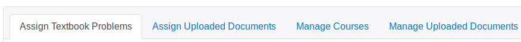

# Carnap's Course Management Dashboard

This document gives a short description of the Carnap server's
course-management dashboard.

The course management dashboard will be available once you have

1.  *Created a user account*. 

    To do this, just click the [login link](/auth/login) located in the upper
    right hand corner of most Carnap pages.

2.  *Upgraded your account status to "instructor"*. 

    To do this, email Graham Leach-Krouse at [gleachkr@gmail.com](mailto:gleachkr@ksu.edu) 
    using your institutional email address.

Once you are logged in, you'll then be able to access the course management
dashboard by first,

1. navigating to your user page, following the link that replaces "login" in
   the upper right hand corner of most pages; then
2. from your user page, clicking the link at the very top that reads "your
   instructor page is here"

You should then see the course management dashboard. The dashboard has two main
parts: The *class card*, where information for your different classes is
listed, and the *assignment card*, where you can assign problem sets from the
[Carnap Book](/book).[^1] If this is your first time on the instructor page, your
class card is probably empty. So we'll describe the assignment card first.

[^1]: I concede that tabbed cards are not the best UI metaphor. I'm open to
suggestions on this one.

## The Assignment Card

The top of the assignment card looks like this:

There are four main tabs. The first one you want to look at is probably "Manage
Courses".

### Manage Courses

Within this tab, you can create a new course, by giving it a title, an optional
description, a start-date, a total number of available points for the course,
an end-date, and a time-zone. The time zone which is used to determine whether
assignments have been received by a given due date and time. The start-date and
end-date are used to determine when your course will be listed as an option for
enrollment.

Once you've created a course, during the period between the start date and end
date, it will:

1. be visible as an enrollment option for people creating new accounts, or for
   people editing their user information from their user pages;
2. become visible to you as a target for assignments in the other tabs; and
3. appear as a tab in your class-card (see below).

After the end-date of the course, the class will be archived at the bottom of
the manage-courses tab, under the heading "Old Courses". Once the class is
archived, You'll still be able to edit the class' properties, download grades
as a `.csv` file, and delete the class. If you need to reactive an archived
class, just set its end-date for some point in the future.

### Assign Textbook Problems

Within this tab, you can assign textbook problem sets from the Carnap book to
your courses, setting particular due-dates and due-times.  There are currently
17 problem sets available, but more are likely to appear in the future. Once a
problem set is assigned to a given class, it will appear on the user-page of
everyone enrolled in that class.

You can also delete assigned problem sets, and replace them with new ones.
Deleting an assigned problem set does not delete submitted student work, so
first deleting then replacing is a safe way to change the due-date of an
assignment.

By default, submitted problems received on time receive 5 points each, and late
submissions receive 2 points each. Both the point amount awarded for a given
problem and the treatment of late problems can be customized—details in the
documentation for [pandoc markup](pandoc.md).  
I find that leaving open the option to submit even *very* late work helps
students who have fallen behind remain motivated, and gives them some incentive
to do extra work that will make the later material easier for them to
understand.

### Assign Uploaded Documents

Within this tab, you can assign documents created using Carnap's [pandoc
markup](pandoc.md). In order to assign a
document, you need to first upload it in the [Manage Uploaded
Documents](#manage-uploaded-documents) tab. Once an assignment is assigned to
given class, it will appear on the user page of everyone enrolled in the class
for the duration of the date and time range of you specify. It will not be
possible for students to make new submissions after the assignment ceases to be
visible.

You can also: 

1. edit the descriptions and due dates associated with assignments from this
   tab, by clicking the gear icon;
2. review the work submitted in connection with this assignment, by clicking
   the pencil icon, and assign partial credit, if any of the problems from the
   assignment have been set to allow for incomplete submissions; and
3. delete assignments, by clicking the trashcan icon next to the assignment.
   Deleting an assignment *deletes all student work associated with that
   assignment*, so be careful when doing this.

Submitted work for assignments is graded in much the same way as work submitted
for textbook problem set. Each problem counts, by default, for five points on
time or two points if late. Problems assigned a custom point value count for
that value if received on time, and otherwise for half that value rounding
down. This will likely become more customizable in the future.

### Manage Uploaded Documents

Within this tab, you can upload documents from which to create assignments in
your classes, and optionally share them, either with other instructors,
publicly, or privately using a link. Documents can be assigned tags, which make
them discoverable once they are shared. A list of shared documents can be found
at [carnap.io/shared](/shared), and the shared documents with a given tag (for
example, the tag "Documentation" can be found at a link like
[carnap.io/shared/Documentation](/shared/Documentation). You can also click on
the name of a tag in most places where it the tag is displayed to see a list of
the associated shared documents.

documents can be of three kinds:

- Problem sets and other materials created using [pandoc markup](pandoc.md) 
- CSS stylesheets for custom styling of your course materials
- JS scripts for more sophisticated customization of your course materials

Uploaded files will be interpreted as problem sets unless they have the
filename extension "css" or "js", so unless they are called something like
"custom-stylesheet.css". or "my-script.js". For more information on how to
apply custom styling and behavior, see the "other features" section in the
documentation of [Carnap's pandoc
markup](pandoc.md).

Once documents are uploaded, they can also be assigned to students as problem
sets, using the [Assign Uploaded Documents](#assign-uploaded-documents)

Again, to edit the attributes of an uploaded document, click the gear icon.  You can
also delete documents with the trashcan icon, or download them with the cloud
icon.

## The Class Card

Once you've created a class, the class card will look a bit like this:

Different classes are available under different tabs.

The available functions are hopefully clear enough. In the upper half,
statistics for different assignments are available, and in the lower half, a
table of students and total scores earned by those students is visible.
Students can be dropped from a class by clicking the "delete" icon visible to
the right of their name, in the "Action" column of the table of students. A
dropped student is removed from the class, but their data is otherwise intact.
So if they are dropped by mistake, then can simply re-enroll. Students can also
be emailed individually by clicking the "mail" icon visible in the action
column to the right of their name.

Below the table of students, you'll see some course information, including the
course title, points available, the start and end date for your course, the
time zone, and an enrollment link you can give to students which will
automatically enroll them in your course after they register.

At the very bottom, you have the options of adding a co-instructor, editing a
class's information, exporting grades, and also of deleting the class. 

Co-instructors are other instructors who have the same type of access to the
class as the class creator. They may be useful if you have a TA or if you're
teaching a class with someone else. Co-instructors can be removed from within
the class card by clicking the trash icon next to their name. Removing a
co-instructor will also remove all assignments created by that co-instructor
and all student work submitted in response to those assignments, so *always
exercise caution when removing a co-instructor*!

Grades are exported in `.csv` format, which most spreadsheet programs should be
able to import. Deleting the class will delete all assignments associated with
the class and all student work submitted in response to these assignments, so
*always exercise caution when deleting a class*!
