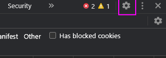

## LTI Information for Carnap Developers

Setting up a Canvas instance or other LMS is quite burdensome for doing LTI
testing. Therefore, the UBC Carnap team has kindly set up a LTI Reference
Implementation platform here:

https://lti-ri.imsglobal.org/platforms/1255/

Configure it in Carnap at `/master_admin` with the following:

<div class="table">
<table>
<thead>
    <tr class="header">
        <th>iss</th>
        <th>client_id</th>
        <th>OIDC Auth Endpoint</th>
        <th>JWK URL</th>
    </tr>
</thead>
<tbody>
    <tr class="odd">
        <td>aaaaa</td>
        <td>abcde</td>
        <td>https://lti-ri.imsglobal.org/platforms/1255/authorizations/new</td>
        <td>https://lti-ri.imsglobal.org/platforms/1255/platform_keys/1248.json</td>
    </tr>
</tbody>
</table>
</div>

To perform launches, use the "Resource Links" page.

## Debugging

Carnap records LTI tokens (with student data removed) to its server logs for
the purposes of debugging automatic LTI registration, allowing to find out why
automatic registration is failing. If that is not sufficient, some debugging
can be done client-side by looking at browser request logs in the network tab
of the developer tools:

Most of the process can be traced with dev tools. Note that Chrome now has a
feature called "Auto-open DevTools for popups" that is ideal for debugging LTI
failing to initiate properly in a popup. Remember to enable "Preserve log"
before testing the problematic path.

These settings are accessible here:

Click the gear icon at the top right of the DevTools panel:



Then the setting is in the bottom right under Global:


---

Using this feature and the network tab, you can find the failing
`initiate`/other request and figure out what the LMS is sending with its
requests and how Carnap reacted.

Let's go through a successful sequence of requests in DevTools. My Canvas is at
`http://ubuntu-vm:8900` and my Carnap is at
`https://ubc-carnap-staging.lfcode.ca` (these are both test instances running
on virtual machines on my computer).

---

I click the "Carnap" link in the Canvas sidebar. A new tab opens, Canvas goes
through a couple of pages itself before sending us to Carnap.

First we have a POST to Carnap's `/auth/page/lti13/initiate` with the following
parameters in the form data:

```
iss: https://canvas.instructure.com
login_hint: f326d6a8a55f30f47b2480586f97991ab9e602bb
client_id: 10000000000002
target_link_uri: https://ubc-carnap-staging.lfcode.ca/
lti_message_hint: some-long-jwt-that-is-opaque-per-the-standard
canvas_region: not_configured
```

The main thing to note here is that this is where Carnap has to decide where to
send the user back to. This is done with a combination of `iss` and
`client_id`, the latter of which is optional and we do our best if it's not
there.

Carnap finds a record in its LTI platforms with the `iss`uer and `client_id`
pair, so it sends a 303 redirect to
`http://ubuntu-vm:8900/api/lti/authorize_redirect` as configured in the Carnap
LTI settings.

Carnap sends the browser a redirect to this URL:

```
http://ubuntu-vm:8900/api/lti/authorize_redirect
    ?scope=openid
    &response_type=id_token
    &client_id=10000000000002
    &redirect_uri=https%3A%2F%2Fubc-carnap-staging.lfcode.ca%2Fauth%2Fpage%2Flti13%2Fauthenticate
    &login_hint=f326d6a8a55f30f47b2480586f97991ab9e602bb
    &state=3CjT-Wa3RKZjgge6bjPNEycuOToQdTUa1ELW3Jx38Gh6&response_mode=form_post
    &nonce=eara1fJmG39MIIijSv-ehGUMJsX2SVhlYhGZdxcsCJKa
    &prompt=none
    &lti_message_hint=some-long-jwt-that-is-opaque-per-the-standard
```

Things of note in this request:

* We generate the `redirect_uri`.
* The `client_id`, `login_hint`, and `lti_message_hint` are just from Canvas' initiation
* `state` and `nonce` are just randomly generated strings we check on the way back.
* Some of these parameters are kept in the session by Carnap, so if cookies
  don't work, we fail either at this request or the next.

----

The browser hits Canvas at that URL, and it bounces around a bit before coming
back to Carnap with a POST
`https://ubc-carnap-staging.lfcode.ca/auth/page/lti13/authenticate`.


Its parameters are:

```
utf8: ✓
authenticity_token: VtRVOQdeoLQqfnzuNSa3kfg8vyuhcWj8lhsehEsmhx4ukCdsPxiT/3MYF416c+Tiyw7zGZFAGpfeTXPXAkTFRg==
id_token: ey -- THIS IS A VERY LONG JWT TOKEN --
state: 3CjT-Wa3RKZjgge6bjPNEycuOToQdTUa1ELW3Jx38Gh6
```

We don't care about any of these except for the very long `id_token`, which is
a JSON Web Token.

Carnap receives this, performs autoregistration, and goes to the user page.
Thus, this is where you will want to start looking if you are having issues
with attributes getting across, for example names, emails, etc.

[View the token in a JWT debugging tool](https://jwt.io/#debugger-io?token=eyJ0eXAiOiJKV1QiLCJhbGciOiJSUzI1NiIsImtpZCI6IjIwMTgtMDYtMThUMjI6MzM6MjBaIn0.eyJodHRwczovL3B1cmwuaW1zZ2xvYmFsLm9yZy9zcGVjL2x0aS9jbGFpbS9tZXNzYWdlX3R5cGUiOiJMdGlSZXNvdXJjZUxpbmtSZXF1ZXN0IiwiaHR0cHM6Ly9wdXJsLmltc2dsb2JhbC5vcmcvc3BlYy9sdGkvY2xhaW0vdmVyc2lvbiI6IjEuMy4wIiwiaHR0cHM6Ly9wdXJsLmltc2dsb2JhbC5vcmcvc3BlYy9sdGkvY2xhaW0vcmVzb3VyY2VfbGluayI6eyJpZCI6IjRkZGUwNWU4Y2ExOTczYmNjYTliZmZjMTNlMTU0ODgyMGVlZTkzYTMiLCJkZXNjcmlwdGlvbiI6bnVsbCwidGl0bGUiOm51bGwsInZhbGlkYXRpb25fY29udGV4dCI6bnVsbCwiZXJyb3JzIjp7ImVycm9ycyI6e319fSwiaHR0cHM6Ly9wdXJsLmltc2dsb2JhbC5vcmcvc3BlYy9sdGktYWdzL2NsYWltL2VuZHBvaW50Ijp7InNjb3BlIjpbImh0dHBzOi8vcHVybC5pbXNnbG9iYWwub3JnL3NwZWMvbHRpLWFncy9zY29wZS9saW5laXRlbSIsImh0dHBzOi8vcHVybC5pbXNnbG9iYWwub3JnL3NwZWMvbHRpLWFncy9zY29wZS9yZXN1bHQucmVhZG9ubHkiLCJodHRwczovL3B1cmwuaW1zZ2xvYmFsLm9yZy9zcGVjL2x0aS1hZ3Mvc2NvcGUvc2NvcmUiXSwibGluZWl0ZW1zIjoiaHR0cDovL3VidW50dS12bTo4OTAwL2FwaS9sdGkvY291cnNlcy8xL2xpbmVfaXRlbXMiLCJ2YWxpZGF0aW9uX2NvbnRleHQiOm51bGwsImVycm9ycyI6eyJlcnJvcnMiOnt9fX0sImF1ZCI6IjEwMDAwMDAwMDAwMDAyIiwiYXpwIjoiMTAwMDAwMDAwMDAwMDIiLCJodHRwczovL3B1cmwuaW1zZ2xvYmFsLm9yZy9zcGVjL2x0aS9jbGFpbS9kZXBsb3ltZW50X2lkIjoiMTo0ZGRlMDVlOGNhMTk3M2JjY2E5YmZmYzEzZTE1NDg4MjBlZWU5M2EzIiwiZXhwIjoxNjEwNTMxMDAyLCJpYXQiOjE2MTA1Mjc0MDIsImlzcyI6Imh0dHBzOi8vY2FudmFzLmluc3RydWN0dXJlLmNvbSIsIm5vbmNlIjoiZWFyYTFmSm1HMzlNSUlpalN2LWVoR1VNSnNYMlNWaGxZaEdaZHhjc0NKS2EiLCJzdWIiOiI1MTk3MTg3ZS00MDcwLTQ2NGUtYjdkYy0yMjllN2M3NmFhMmUiLCJodHRwczovL3B1cmwuaW1zZ2xvYmFsLm9yZy9zcGVjL2x0aS9jbGFpbS90YXJnZXRfbGlua191cmkiOiJodHRwczovL3ViYy1jYXJuYXAtc3RhZ2luZy5sZmNvZGUuY2EvIiwiaHR0cHM6Ly9wdXJsLmltc2dsb2JhbC5vcmcvc3BlYy9sdGkvY2xhaW0vY29udGV4dCI6eyJpZCI6IjRkZGUwNWU4Y2ExOTczYmNjYTliZmZjMTNlMTU0ODgyMGVlZTkzYTMiLCJsYWJlbCI6IkMxIiwidGl0bGUiOiJUZXN0IENvdXJzZSIsInR5cGUiOlsiaHR0cDovL3B1cmwuaW1zZ2xvYmFsLm9yZy92b2NhYi9saXMvdjIvY291cnNlI0NvdXJzZU9mZmVyaW5nIl0sInZhbGlkYXRpb25fY29udGV4dCI6bnVsbCwiZXJyb3JzIjp7ImVycm9ycyI6e319fSwiaHR0cHM6Ly9wdXJsLmltc2dsb2JhbC5vcmcvc3BlYy9sdGkvY2xhaW0vdG9vbF9wbGF0Zm9ybSI6eyJndWlkIjoiQmJuMHNuMk03b1FuUGxveG5jZ0dmWkJ1UmhkN3Y5SVQ4ZU5OYWxsejpjYW52YXMtbG1zIiwibmFtZSI6IkphZGVDYW52YXMiLCJ2ZXJzaW9uIjoiY2xvdWQiLCJwcm9kdWN0X2ZhbWlseV9jb2RlIjoiY2FudmFzIiwidmFsaWRhdGlvbl9jb250ZXh0IjpudWxsLCJlcnJvcnMiOnsiZXJyb3JzIjp7fX19LCJodHRwczovL3B1cmwuaW1zZ2xvYmFsLm9yZy9zcGVjL2x0aS9jbGFpbS9sYXVuY2hfcHJlc2VudGF0aW9uIjp7ImRvY3VtZW50X3RhcmdldCI6ImlmcmFtZSIsImhlaWdodCI6ODAwLCJ3aWR0aCI6ODAwLCJyZXR1cm5fdXJsIjoiaHR0cDovL3VidW50dS12bTo4OTAwL2NvdXJzZXMvMS9leHRlcm5hbF9jb250ZW50L3N1Y2Nlc3MvZXh0ZXJuYWxfdG9vbF9yZWRpcmVjdCIsImxvY2FsZSI6ImVuLUNBIiwidmFsaWRhdGlvbl9jb250ZXh0IjpudWxsLCJlcnJvcnMiOnsiZXJyb3JzIjp7fX19LCJsb2NhbGUiOiJlbi1DQSIsImh0dHBzOi8vcHVybC5pbXNnbG9iYWwub3JnL3NwZWMvbHRpL2NsYWltL3JvbGVzIjpbImh0dHA6Ly9wdXJsLmltc2dsb2JhbC5vcmcvdm9jYWIvbGlzL3YyL2luc3RpdHV0aW9uL3BlcnNvbiNTdHVkZW50IiwiaHR0cDovL3B1cmwuaW1zZ2xvYmFsLm9yZy92b2NhYi9saXMvdjIvbWVtYmVyc2hpcCNMZWFybmVyIiwiaHR0cDovL3B1cmwuaW1zZ2xvYmFsLm9yZy92b2NhYi9saXMvdjIvc3lzdGVtL3BlcnNvbiNVc2VyIl0sImh0dHBzOi8vcHVybC5pbXNnbG9iYWwub3JnL3NwZWMvbHRpL2NsYWltL2N1c3RvbSI6e30sImh0dHBzOi8vcHVybC5pbXNnbG9iYWwub3JnL3NwZWMvbHRpLW5ycHMvY2xhaW0vbmFtZXNyb2xlc2VydmljZSI6eyJjb250ZXh0X21lbWJlcnNoaXBzX3VybCI6Imh0dHA6Ly91YnVudHUtdm06ODkwMC9hcGkvbHRpL2NvdXJzZXMvMS9uYW1lc19hbmRfcm9sZXMiLCJzZXJ2aWNlX3ZlcnNpb25zIjpbIjIuMCJdLCJ2YWxpZGF0aW9uX2NvbnRleHQiOm51bGwsImVycm9ycyI6eyJlcnJvcnMiOnt9fX0sImh0dHBzOi8vcHVybC5pbXNnbG9iYWwub3JnL3NwZWMvbHRpL2NsYWltL2x0aTExX2xlZ2FjeV91c2VyX2lkIjoiZjMyNmQ2YThhNTVmMzBmNDdiMjQ4MDU4NmY5Nzk5MWFiOWU2MDJiYiIsImVycm9ycyI6eyJlcnJvcnMiOnt9fSwicGljdHVyZSI6Imh0dHA6Ly9jYW52YXMuaW5zdHJ1Y3R1cmUuY29tL2ltYWdlcy9tZXNzYWdlcy9hdmF0YXItNTAucG5nIiwibmFtZSI6IkpvZSBVc2VyIiwiZ2l2ZW5fbmFtZSI6IkpvZSIsImZhbWlseV9uYW1lIjoiVXNlciIsImh0dHBzOi8vcHVybC5pbXNnbG9iYWwub3JnL3NwZWMvbHRpL2NsYWltL2xpcyI6eyJwZXJzb25fc291cmNlZGlkIjoiU0lTNTc4IiwiY291cnNlX29mZmVyaW5nX3NvdXJjZWRpZCI6bnVsbCwidmFsaWRhdGlvbl9jb250ZXh0IjpudWxsLCJlcnJvcnMiOnsiZXJyb3JzIjp7fX19fQ.S8877d2gIAi9tjIbhz13l8pPvSVlZjZdEAAXEzAjR3DahZC7MUooPsNeKGOgc_RVx9zBRZn1HFbkanGheZyXGg)

