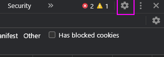
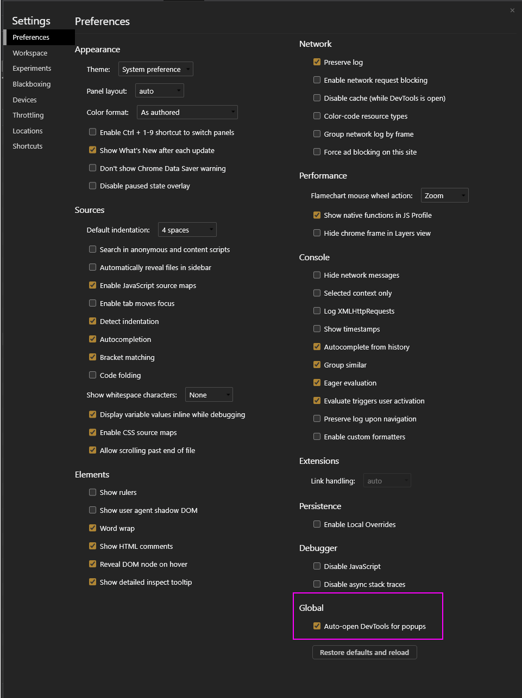

# LTI 1.3

Carnap supports [LTI 1.3](http://www.imsglobal.org/spec/lti/v1p3/) for login,
allowing it to be placed directly in a Canvas course. No previous versions
superseded by LTI 1.3 including LTI 1.0, 1.1, or 2.0 are supported.

Various major LMS implementations including Moodle and Canvas support LTI 1.3
natively.

## LTI setup in a Learning Management System

Carnap.io's configuration parameters are:

* `oidc_initiation_url`: https://carnap.io/auth/page/lti13/initiate
* `target_link_uri`: https://carnap.io
* Public JWK URL: https://carnap.io/auth/page/lti13/jwks
* Redirect URLs: https://carnap.io/auth/page/lti13/authenticate

If you are running your own instance of the Carnap server, you will use the
same paths but with your custom domain name replacing "carnap.io".

### Common LMS: Canvas

Instructions for configuring an LTI key for Canvas can be found here:
[Configuring an LTI
key](https://community.canvaslms.com/t5/Admin-Guide/How-do-I-configure-an-LTI-key-for-an-account/ta-p/140).
This will require someone with administrator access to your Canvas instance, so
you may need to speak to someone in your IT department to get this set up.

Canvas allows configurations to be imported rather than set manually, via the
"Paste JSON" option described in the documentation linked above. A JSON file
for easy configuration of a Canvas instance using this method is reproduced
below.

Once the LTI key is configured in your Canvas instance, you'll need to ask your
Canvas administrator for the client ID number associated with the key, and
follow the instructions here: [Adding Carnap To Your
Course](https://community.canvaslms.com/t5/Admin-Guide/How-do-I-configure-an-external-app-for-an-account-using-a-client/ta-p/202).

For more details on Canvas setup with LTI 1.3, see:

* [Technical documentation](https://canvas.instructure.com/doc/api/file.lti_dev_key_config.html).
  This is also a nice general overview of the protocol.
* [Configuring an LTI key](https://community.canvaslms.com/t5/Admin-Guide/How-do-I-configure-an-LTI-key-for-an-account/ta-p/140)
* [Adding Carnap To Your
Course](https://community.canvaslms.com/t5/Admin-Guide/How-do-I-configure-an-external-app-for-an-account-using-a-client/ta-p/202)

#### JSON Configuration with Canvas.


```json
{
   "title": "Carnap",
   "description": "Carnap Logic Framework",
   "oidc_initiation_url": "https://carnap.io/auth/page/lti13/initiate",
   "target_link_uri": "https://carnap.io/",
   "public_jwk_url": "https://carnap.io/auth/page/lti13/jwks",
   "scopes": [
      "https://purl.imsglobal.org/spec/lti-ags/scope/lineitem",
      "https://purl.imsglobal.org/spec/lti-ags/scope/result.readonly",
      "https://purl.imsglobal.org/spec/lti-ags/scope/score",
      "https://purl.imsglobal.org/spec/lti-nrps/scope/contextmembership.readonly"
   ],
   "extensions": [
      {
         "domain": "carnap.io",
         "tool_id": "Carnap.io",
         "platform": "canvas.instructure.com",
         "settings": {
            "text": "Carnap",
            "selection_height": 800,
            "selection_width": 800,
            "privacy_level": "public",
            "placements": [
               {
                  "text": "Carnap",
                  "enabled": true,
                  "placement": "course_navigation",
                  "message_type": "LtiResourceLinkRequest",
                  "target_link_uri": "https://carnap.io/",
                  "windowTarget": "_blank"
               }
            ]
         }
      }
   ]
}
```

Note: It is possible to use Carnap in an `iframe` (so it appears in the Canvas
page without opening a new tab), but there are caveats, especially around
support for Safari and other WebKit browsers, since they are very aggressive
about third-party cookie blocking. If you want to try this, remove the
`"windowTarget": "_blank"` in the JSON.

## LTI Setup (Carnap side)

After your LTI provider is configured to talk to Carnap, it needs to be
registered on the Carnap server. For setup with the public Carnap instance at
Carnap.io, [contact Graham](mailto:gleachkr@ksu.edu) with the following details
from your LMS:

* Public JWKs URL
* Authorization Redirect URL
* Client ID

For example, for a cloud Canvas (production environment), these would be:

* JWK URL: `https://canvas.instructure.com/api/lti/security/jwks`
* Authorization redirect URL: `https://canvas.instructure.com/api/lti/authorize_redirect`
* Client ID: from your LTI developer key
* Deployment ID: not required for Carnap

If you are running a self-hosted instance of Carnap, you can configure LTI
Platforms (Learning Management Systems) on the admin page at
`https://carnap.example.com/master_admin`.


## Automatic registration

Automatic registration links a class on the Carnap server to a class in an LMS,
and automatically registers students in the Carnap class when they log in to
Carnap from the associated course in the LMS LMS.

### Setup

Set up LTI in your learning management system. Then, initiate a launch by
attempting to log in to Carnap from the LMS course that you want to connect to
Carnap. A message will appear on the carnap user registration page giving you
an autoregistration ID. Copy this ID down, and go to your instructor page on
Carnap. Select the course that you wish to associate with your LMS course, and
edit the course information. In the course information, there will be a field
where you can paste the autoregistration ID.

Once that ID has been configured, all future launches from your LMS course will
be registered in the associated Carnap course automatically.

### Notes

* Automatic registrations are allowed even if your course is closed (even if
you've unchecked the "course open" box on your instructor page). So, you can
set registration to be LTI only simply by setting your course to be closed.

* Students will have their user information automatically synchronized with the
LMS on every launch, so if they want to change their name or other details,
that should be accomplished in the LMS or other upstream systems.

## Developer use

Setting up a Canvas instance or other LMS is quite burdensome for doing LTI
testing. Therefore, the UBC Carnap team has kindly set up a LTI Reference
Implementation platform here:

https://lti-ri.imsglobal.org/platforms/1255/

Configure it in Carnap at `/master_admin` with the following:

<div class="table">
<table>
<thead>
    <tr class="header">
        <th>iss</th>
        <th>client_id</th>
        <th>OIDC Auth Endpoint</th>
        <th>JWK URL</th>
    </tr>
</thead>
<tbody>
    <tr class="odd">
        <td>aaaaa</td>
        <td>abcde</td>
        <td>https://lti-ri.imsglobal.org/platforms/1255/authorizations/new</td>
        <td>https://lti-ri.imsglobal.org/platforms/1255/platform_keys/1248.json</td>
    </tr>
</tbody>
</table>
</div>

To perform launches, use the "Resource Links" page.

## Debugging

Most of the process can be traced with dev tools. Note that Chrome now has a
feature called "Auto-open DevTools for popups" that is ideal for debugging LTI
failing to initiate properly in a popup. Remember to enable "Preserve log"
before testing the problematic path.

These settings are accessible here:

Click the gear icon at the top right of the DevTools panel:



Then the setting is in the bottom right under Global:



---

Using this feature and the network tab, you can find the failing
`initiate`/other request and figure out what the LMS is sending with its
requests and how Carnap reacted.

Let's go through a successful sequence of requests in DevTools. My Canvas is at
`http://ubuntu-vm:8900` and my Carnap is at
`https://ubc-carnap-staging.lfcode.ca` (these are both test instances running
on virtual machines on my computer).

---

I click the "Carnap" link in the Canvas sidebar. A new tab opens, Canvas goes
through a couple of pages itself before sending us to Carnap.

First we have a POST to Carnap's `/auth/page/lti13/initiate` with the following
parameters in the form data:

```
iss: https://canvas.instructure.com
login_hint: f326d6a8a55f30f47b2480586f97991ab9e602bb
client_id: 10000000000002
target_link_uri: https://ubc-carnap-staging.lfcode.ca/
lti_message_hint: some-long-jwt-that-is-opaque-per-the-standard
canvas_region: not_configured
```

The main thing to note here is that this is where Carnap has to decide where to
send the user back to. This is done with a combination of `iss` and
`client_id`, the latter of which is optional and we do our best if it's not
there.

Carnap finds a record in its LTI platforms with the `iss`uer and `client_id`
pair, so it sends a 303 redirect to
`http://ubuntu-vm:8900/api/lti/authorize_redirect` as configured in the Carnap
LTI settings.

Carnap sends the browser a redirect to this URL:

```
http://ubuntu-vm:8900/api/lti/authorize_redirect
    ?scope=openid
    &response_type=id_token
    &client_id=10000000000002
    &redirect_uri=https%3A%2F%2Fubc-carnap-staging.lfcode.ca%2Fauth%2Fpage%2Flti13%2Fauthenticate
    &login_hint=f326d6a8a55f30f47b2480586f97991ab9e602bb
    &state=3CjT-Wa3RKZjgge6bjPNEycuOToQdTUa1ELW3Jx38Gh6&response_mode=form_post
    &nonce=eara1fJmG39MIIijSv-ehGUMJsX2SVhlYhGZdxcsCJKa
    &prompt=none
    &lti_message_hint=some-long-jwt-that-is-opaque-per-the-standard
```

Things of note in this request:

* We generate the `redirect_uri`.
* The `client_id`, `login_hint`, and `lti_message_hint` are just from Canvas' initiation
* `state` and `nonce` are just randomly generated strings we check on the way back.
* Some of these parameters are kept in the session by Carnap, so if cookies
  don't work, we fail either at this request or the next.

----

The browser hits Canvas at that URL, and it bounces around a bit before coming
back to Carnap with a POST
`https://ubc-carnap-staging.lfcode.ca/auth/page/lti13/authenticate`.


Its parameters are:

```
utf8: ✓
authenticity_token: VtRVOQdeoLQqfnzuNSa3kfg8vyuhcWj8lhsehEsmhx4ukCdsPxiT/3MYF416c+Tiyw7zGZFAGpfeTXPXAkTFRg==
id_token: ey -- THIS IS A VERY LONG JWT TOKEN --
state: 3CjT-Wa3RKZjgge6bjPNEycuOToQdTUa1ELW3Jx38Gh6
```

We don't care about any of these except for the very long `id_token`, which is
a JSON Web Token.

Carnap receives this, performs autoregistration, and goes to the user page.
Thus, this is where you will want to start looking if you are having issues
with attributes getting across, for example names, emails, etc.

[View the token in a JWT debugging tool](https://jwt.io/#debugger-io?token=eyJ0eXAiOiJKV1QiLCJhbGciOiJSUzI1NiIsImtpZCI6IjIwMTgtMDYtMThUMjI6MzM6MjBaIn0.eyJodHRwczovL3B1cmwuaW1zZ2xvYmFsLm9yZy9zcGVjL2x0aS9jbGFpbS9tZXNzYWdlX3R5cGUiOiJMdGlSZXNvdXJjZUxpbmtSZXF1ZXN0IiwiaHR0cHM6Ly9wdXJsLmltc2dsb2JhbC5vcmcvc3BlYy9sdGkvY2xhaW0vdmVyc2lvbiI6IjEuMy4wIiwiaHR0cHM6Ly9wdXJsLmltc2dsb2JhbC5vcmcvc3BlYy9sdGkvY2xhaW0vcmVzb3VyY2VfbGluayI6eyJpZCI6IjRkZGUwNWU4Y2ExOTczYmNjYTliZmZjMTNlMTU0ODgyMGVlZTkzYTMiLCJkZXNjcmlwdGlvbiI6bnVsbCwidGl0bGUiOm51bGwsInZhbGlkYXRpb25fY29udGV4dCI6bnVsbCwiZXJyb3JzIjp7ImVycm9ycyI6e319fSwiaHR0cHM6Ly9wdXJsLmltc2dsb2JhbC5vcmcvc3BlYy9sdGktYWdzL2NsYWltL2VuZHBvaW50Ijp7InNjb3BlIjpbImh0dHBzOi8vcHVybC5pbXNnbG9iYWwub3JnL3NwZWMvbHRpLWFncy9zY29wZS9saW5laXRlbSIsImh0dHBzOi8vcHVybC5pbXNnbG9iYWwub3JnL3NwZWMvbHRpLWFncy9zY29wZS9yZXN1bHQucmVhZG9ubHkiLCJodHRwczovL3B1cmwuaW1zZ2xvYmFsLm9yZy9zcGVjL2x0aS1hZ3Mvc2NvcGUvc2NvcmUiXSwibGluZWl0ZW1zIjoiaHR0cDovL3VidW50dS12bTo4OTAwL2FwaS9sdGkvY291cnNlcy8xL2xpbmVfaXRlbXMiLCJ2YWxpZGF0aW9uX2NvbnRleHQiOm51bGwsImVycm9ycyI6eyJlcnJvcnMiOnt9fX0sImF1ZCI6IjEwMDAwMDAwMDAwMDAyIiwiYXpwIjoiMTAwMDAwMDAwMDAwMDIiLCJodHRwczovL3B1cmwuaW1zZ2xvYmFsLm9yZy9zcGVjL2x0aS9jbGFpbS9kZXBsb3ltZW50X2lkIjoiMTo0ZGRlMDVlOGNhMTk3M2JjY2E5YmZmYzEzZTE1NDg4MjBlZWU5M2EzIiwiZXhwIjoxNjEwNTMxMDAyLCJpYXQiOjE2MTA1Mjc0MDIsImlzcyI6Imh0dHBzOi8vY2FudmFzLmluc3RydWN0dXJlLmNvbSIsIm5vbmNlIjoiZWFyYTFmSm1HMzlNSUlpalN2LWVoR1VNSnNYMlNWaGxZaEdaZHhjc0NKS2EiLCJzdWIiOiI1MTk3MTg3ZS00MDcwLTQ2NGUtYjdkYy0yMjllN2M3NmFhMmUiLCJodHRwczovL3B1cmwuaW1zZ2xvYmFsLm9yZy9zcGVjL2x0aS9jbGFpbS90YXJnZXRfbGlua191cmkiOiJodHRwczovL3ViYy1jYXJuYXAtc3RhZ2luZy5sZmNvZGUuY2EvIiwiaHR0cHM6Ly9wdXJsLmltc2dsb2JhbC5vcmcvc3BlYy9sdGkvY2xhaW0vY29udGV4dCI6eyJpZCI6IjRkZGUwNWU4Y2ExOTczYmNjYTliZmZjMTNlMTU0ODgyMGVlZTkzYTMiLCJsYWJlbCI6IkMxIiwidGl0bGUiOiJUZXN0IENvdXJzZSIsInR5cGUiOlsiaHR0cDovL3B1cmwuaW1zZ2xvYmFsLm9yZy92b2NhYi9saXMvdjIvY291cnNlI0NvdXJzZU9mZmVyaW5nIl0sInZhbGlkYXRpb25fY29udGV4dCI6bnVsbCwiZXJyb3JzIjp7ImVycm9ycyI6e319fSwiaHR0cHM6Ly9wdXJsLmltc2dsb2JhbC5vcmcvc3BlYy9sdGkvY2xhaW0vdG9vbF9wbGF0Zm9ybSI6eyJndWlkIjoiQmJuMHNuMk03b1FuUGxveG5jZ0dmWkJ1UmhkN3Y5SVQ4ZU5OYWxsejpjYW52YXMtbG1zIiwibmFtZSI6IkphZGVDYW52YXMiLCJ2ZXJzaW9uIjoiY2xvdWQiLCJwcm9kdWN0X2ZhbWlseV9jb2RlIjoiY2FudmFzIiwidmFsaWRhdGlvbl9jb250ZXh0IjpudWxsLCJlcnJvcnMiOnsiZXJyb3JzIjp7fX19LCJodHRwczovL3B1cmwuaW1zZ2xvYmFsLm9yZy9zcGVjL2x0aS9jbGFpbS9sYXVuY2hfcHJlc2VudGF0aW9uIjp7ImRvY3VtZW50X3RhcmdldCI6ImlmcmFtZSIsImhlaWdodCI6ODAwLCJ3aWR0aCI6ODAwLCJyZXR1cm5fdXJsIjoiaHR0cDovL3VidW50dS12bTo4OTAwL2NvdXJzZXMvMS9leHRlcm5hbF9jb250ZW50L3N1Y2Nlc3MvZXh0ZXJuYWxfdG9vbF9yZWRpcmVjdCIsImxvY2FsZSI6ImVuLUNBIiwidmFsaWRhdGlvbl9jb250ZXh0IjpudWxsLCJlcnJvcnMiOnsiZXJyb3JzIjp7fX19LCJsb2NhbGUiOiJlbi1DQSIsImh0dHBzOi8vcHVybC5pbXNnbG9iYWwub3JnL3NwZWMvbHRpL2NsYWltL3JvbGVzIjpbImh0dHA6Ly9wdXJsLmltc2dsb2JhbC5vcmcvdm9jYWIvbGlzL3YyL2luc3RpdHV0aW9uL3BlcnNvbiNTdHVkZW50IiwiaHR0cDovL3B1cmwuaW1zZ2xvYmFsLm9yZy92b2NhYi9saXMvdjIvbWVtYmVyc2hpcCNMZWFybmVyIiwiaHR0cDovL3B1cmwuaW1zZ2xvYmFsLm9yZy92b2NhYi9saXMvdjIvc3lzdGVtL3BlcnNvbiNVc2VyIl0sImh0dHBzOi8vcHVybC5pbXNnbG9iYWwub3JnL3NwZWMvbHRpL2NsYWltL2N1c3RvbSI6e30sImh0dHBzOi8vcHVybC5pbXNnbG9iYWwub3JnL3NwZWMvbHRpLW5ycHMvY2xhaW0vbmFtZXNyb2xlc2VydmljZSI6eyJjb250ZXh0X21lbWJlcnNoaXBzX3VybCI6Imh0dHA6Ly91YnVudHUtdm06ODkwMC9hcGkvbHRpL2NvdXJzZXMvMS9uYW1lc19hbmRfcm9sZXMiLCJzZXJ2aWNlX3ZlcnNpb25zIjpbIjIuMCJdLCJ2YWxpZGF0aW9uX2NvbnRleHQiOm51bGwsImVycm9ycyI6eyJlcnJvcnMiOnt9fX0sImh0dHBzOi8vcHVybC5pbXNnbG9iYWwub3JnL3NwZWMvbHRpL2NsYWltL2x0aTExX2xlZ2FjeV91c2VyX2lkIjoiZjMyNmQ2YThhNTVmMzBmNDdiMjQ4MDU4NmY5Nzk5MWFiOWU2MDJiYiIsImVycm9ycyI6eyJlcnJvcnMiOnt9fSwicGljdHVyZSI6Imh0dHA6Ly9jYW52YXMuaW5zdHJ1Y3R1cmUuY29tL2ltYWdlcy9tZXNzYWdlcy9hdmF0YXItNTAucG5nIiwibmFtZSI6IkpvZSBVc2VyIiwiZ2l2ZW5fbmFtZSI6IkpvZSIsImZhbWlseV9uYW1lIjoiVXNlciIsImh0dHBzOi8vcHVybC5pbXNnbG9iYWwub3JnL3NwZWMvbHRpL2NsYWltL2xpcyI6eyJwZXJzb25fc291cmNlZGlkIjoiU0lTNTc4IiwiY291cnNlX29mZmVyaW5nX3NvdXJjZWRpZCI6bnVsbCwidmFsaWRhdGlvbl9jb250ZXh0IjpudWxsLCJlcnJvcnMiOnsiZXJyb3JzIjp7fX19fQ.S8877d2gIAi9tjIbhz13l8pPvSVlZjZdEAAXEzAjR3DahZC7MUooPsNeKGOgc_RVx9zBRZn1HFbkanGheZyXGg)

