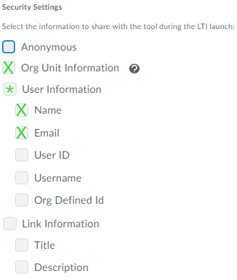

# LTI 1.3

Carnap supports [LTI 1.3](http://www.imsglobal.org/spec/lti/v1p3/) for
login.[^1] This allows Carnap to be launched directly from a Learning
Management System, and to hand over management of user account data (like
email, name, and student ID) as well as login, to the LMS. 

[^1]: No previous versions superseded by LTI 1.3 including LTI 1.0, 1.1, or 2.0
are supported.

Various major LMS implementations including Moodle, Brightspace, and Canvas
support LTI 1.3 natively.

## Basic Setup Outline

Connecting Carnap to your university's LMS involves three steps.

1. Your LMS needs to be configured to recognize Carnap
2. Your Carnap server needs to be configured to recognize your LMS
3. Your Carnap class needs to be configured to auto-enroll students who are
   launching Carnap from within your LMS.

Below, you'll find sections on each of these steps.

## Step 1 - Configuring your LMS to recognize Carnap

There are a few generic pieces of information your LMS will need in order to
connect to Carnap. These are as follows:

* `oidc_initiation_url`: https://carnap.io/auth/page/lti13/initiate
* `target_link_uri`: https://carnap.io
* Public JWK URL: https://carnap.io/auth/page/lti13/jwks
* Redirect URLs: https://carnap.io/auth/page/lti13/authenticate

If you are running your own instance of the Carnap server, you will use the
same paths but with your custom domain name replacing "carnap.io".

However, different LMSes need this information to be entered in different
places. This will generally be the responsibility of an LMS administrator,
rather than the responsibility of an individual instructor, so you may need to
work with your IT department to arrange the initial setup of the LMS
integration.

Now - here are instructions on configuring your LMS, for the LMSes we have
experience with. If something is missing or incorrect, please consider opening
an issue [here](https://github.com/Carnap/Carnap-Documentation/issues) or
sending an email to [gleachkr@ksu.edu](mailto:gleachkr@ksu.edu).

<details> 
<summary> Configuring Canvas to use Carnap </summary>

You'll need to begin by configuring an LTI key. This requires administrator
access to your Canvas instance, so if you're an instructor, you may need to
speak to IT. Instructions for configuring an LTI key for Canvas can be found
here: [Configuring an LTI
key](https://community.canvaslms.com/t5/Admin-Guide/How-do-I-configure-an-LTI-key-for-an-account/ta-p/140).

Canvas allows configurations to be imported rather than set manually, via the
"Paste JSON" option described in the documentation linked above. A JSON file
for easy configuration of a Canvas instance using the "Paste JSON" option is
reproduced below.

Once the LTI key is configured in your Canvas instance, you'll also need to add
the "Client Id" number from the key to your course. (If an adminstrator
configured the key for you, you may need to ask them for the Client ID.)
Instructions on adding Carnap to your course using the Client ID can be found
here: [Adding Carnap To Your
Course](https://community.canvaslms.com/t5/Admin-Guide/How-do-I-configure-an-external-app-for-an-account-using-a-client/ta-p/202).

For more details on Canvas setup with LTI 1.3, see:

* [Technical documentation](https://canvas.instructure.com/doc/api/file.lti_dev_key_config.html).
  This is also a nice general overview of the protocol.
* [Configuring an LTI key](https://community.canvaslms.com/t5/Admin-Guide/How-do-I-configure-an-LTI-key-for-an-account/ta-p/140)
* [Adding Carnap To Your Course](https://community.canvaslms.com/t5/Admin-Guide/How-do-I-configure-an-external-app-for-an-account-using-a-client/ta-p/202)

#### JSON Configuration with Canvas.

```json
{
   "title": "Carnap",
   "description": "Carnap Logic Framework",
   "oidc_initiation_url": "https://carnap.io/auth/page/lti13/initiate",
   "target_link_uri": "https://carnap.io/",
   "public_jwk_url": "https://carnap.io/auth/page/lti13/jwks",
   "scopes": [
      "https://purl.imsglobal.org/spec/lti-ags/scope/lineitem",
      "https://purl.imsglobal.org/spec/lti-ags/scope/result.readonly",
      "https://purl.imsglobal.org/spec/lti-ags/scope/score",
      "https://purl.imsglobal.org/spec/lti-nrps/scope/contextmembership.readonly"
   ],
   "extensions": [
      {
         "domain": "carnap.io",
         "tool_id": "Carnap.io",
         "platform": "canvas.instructure.com",
         "settings": {
            "text": "Carnap",
            "selection_height": 800,
            "selection_width": 800,
            "privacy_level": "public",
            "placements": [
               {
                  "text": "Carnap",
                  "enabled": true,
                  "placement": "course_navigation",
                  "message_type": "LtiResourceLinkRequest",
                  "target_link_uri": "https://carnap.io/",
                  "windowTarget": "_blank"
               }
            ]
         }
      }
   ]
}
```

Note: It is possible to use Carnap in an `iframe` (so it appears in the Canvas
page without opening a new tab), but there are caveats, especially around
support for Safari and other WebKit browsers, since they are very aggressive
about third-party cookie blocking. If you want to try this, remove the
`"windowTarget": "_blank"` in the JSON.

</summary>

<summary><details> Configuring Brightspace/D2L to use Carnap </details>

Under [LTI Security Settings], make sure that the following are checked to
allow for automatic registration in your Carnap courses:

* Name
* Org Unit Information

Carnap will also use the Email property to fill in user information if it is
present, but it is not required.

It appears that Brightspace doesn't support sending student ID numbers in the
`lis` claim as `person_sourcedid` like Canvas does. If this is something that
you need for gradebook purposes, it is possible we can make Carnap accept the
Brightspace specific "Org Defined ID" or "User ID" properties for the
Carnap "University ID" field.



For more details on LTI configuration in Brightspace/D2L, see these pages:

* [LTI Integration Guide (links to other pages)](https://community.brightspace.com/generic/s/article/LTI-Integration-Guide)
* [LTI Security Settings and Platform information](https://community.brightspace.com/generic/s/article/LTI-Security-Settings-Consumer-Information)
* [LTI Advantage (LTI 1.3) Administrator Guide](https://community.brightspace.com/s/article/LTI-Advantage-Administrator-Guide)

[LTI Security Settings]: https://community.brightspace.com/generic/s/article/LTI-Security-Settings-Consumer-Information

</summary>

## Step 2 - Configuring Carnap to recognize your LMS

After your LMS is configured to talk to Carnap, it needs to be registered on
the Carnap server. For setup with the public Carnap instance at Carnap.io,
[contact Graham](mailto:gleachkr@ksu.edu) with the following details from your
LMS:

* Public JWKs URL
* Authorization Redirect URL
* Client ID

For example, for a cloud Canvas (production environment), these would be:

* JWK URL: `https://canvas.instructure.com/api/lti/security/jwks`
* Authorization redirect URL: `https://canvas.instructure.com/api/lti/authorize_redirect`
* Client ID: from your LTI developer key
* Deployment ID: not required for Carnap

If you are running a self-hosted instance of Carnap, you can configure LTI
Platforms (Learning Management Systems) on the admin page at
`https://carnap.example.com/master_admin`.

## Step 3 - Configuring your Carnap class for auto-enrollment

Automatic registration links a class on the Carnap server to a class in an LMS,
and automatically registers students in the Carnap class when they log in to
Carnap from the associated course in the LMS LMS.

Once you've completed steps 1 and 2 above, attempt to log in to Carnap from the
LMS course that you want to connect to Carnap. A message will appear on the
Carnap user registration page giving you an autoregistration ID. The ID will
look something like this:

```json
{"ltiDeploymentId":"…", "ltiContextId":"…","ltiIssuer":"…","label":"…"}
```

but with concrete values replacing the ellipses.

Copy this ID down (the whole thing, including the enclosing brackets) and go to
your instructor page on Carnap. Select the course that you wish to associate
with your LMS course, and edit the course information. In the course
information, there will be a field where you can paste the autoregistration ID.

Once that ID has been configured, all future launches from your LMS course will
be registered in the associated Carnap course automatically.

### Notes

* Automatic registrations are allowed even if your course is closed (even if
you've unchecked the "course open" box on your instructor page). So, you can
set registration to be LTI only simply by setting your course to be closed.

* Students will have their user information automatically synchronized with the
LMS on every launch, so if they want to change their name or other details,
that should be accomplished in the LMS or other upstream systems.
