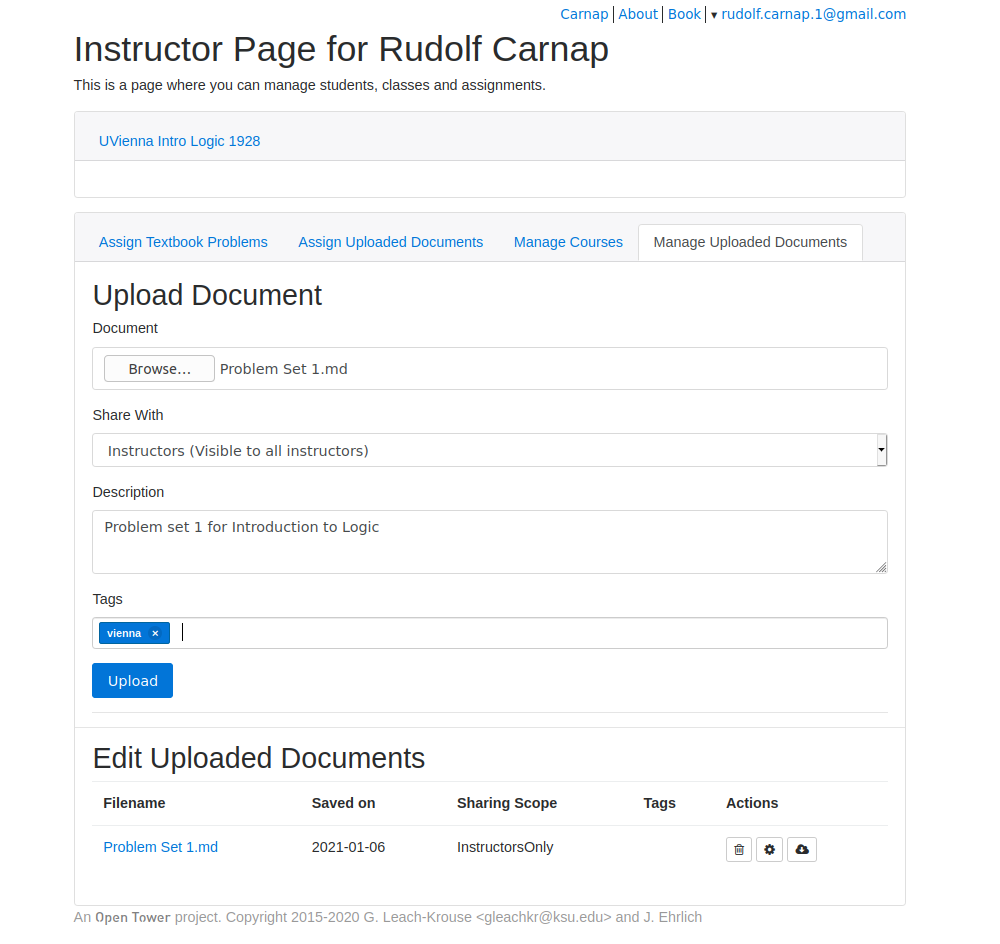

# Carnap Quick Start Guide for Instructors

## Get an account

Click the [login link](/auth/login) located in the upper right hand
corner of most Carnap pages, and log in with a Google account (a Gmail
account works, but you can also make a Google account with a different
email).

Email Graham Leach-Krouse at
[gleachkr@ksu.edu](mailto:gleachkr@ksu.edu) using your institutional
email address to request instructor status.

## Make your first assignment

### Carnap's assignment format

An assignment in Carnap is a document which may include text (e.g.,
instructions for your students, where to find the relevant material in
your textbook, etc.) but mainly will include *Carnap code blocks*.
Each Carnap code block corresponds to one problem.  They can be of any
of the types listed on [the main page](index.html). They are:

1. [Syntax Checking](syntax-check.md)
2. [Translations](translation.md)
3. [Truth Tables](truth-tables.md)
4. [Derivations](derivations.md)
5. [Model Checking](modelchecker.md)
6. [Qualitative Problems](qualitative.md), e.g., multiple-choice

Each assignment document is a plain text file formatted in Markdown, a
simple markup language.  (Typically, the extension of Markdown text
files is `.md`.) You can find a comprehensive introduction in the
[Markdown Guide](https://www.markdownguide.org/) including a list of editors
that support Markdown. For a quick reference, try [Learn Markdown in 60
seconds](https://commonmark.org/help/) Any plain text editor is fine, but
Markdown (and Carnap) are sticklers about spaces and newlines in Markdown
documents.  So make sure your editor does not automatically wrap text.  

### Downloading shared documents

You can start with an existing document another instructor has shared.
A list of shared documents can be found at
[carnap.io/shared](/shared). Each shared document has a download icon
at the bottom (&#xf0ed;). If you
click on that, you can save the source Markdown document of the shared
page to your own computer. You can then edit it.

For instance, here is a [sample
assignment](https://carnap.io/shared/rudolf.carnap.1@gmail.com/Problem%20Set%201.md)
which you can download by adding `/download` to the end of the URL in
your browser (or just [click
here](https://carnap.io/shared/rudolf.carnap.1@gmail.com/Problem%20Set%201.md/download)).

### Converting existing problem sets

If you already have problem sets in another format, you can turn them
into Markdown for use on Carnap. If your problem sets are written in
Word, there is a Markdown export plugin:
[Writeage](https://www.writage.com/). Or, select Save As (Plain Text)
and then recreate the formatting in the resulting text file. If your
sheets are in LaTeX you can use [Pandoc](https://pandoc.org/). Here is
an [online converter](https://pandoc.org/try/) (select from LaTeX to
Markdown (pandoc)).

### Carnap code blocks

Next you turn each problem into a Carnap code block. For instance, a
translation exercise will be put into your Markdown document as:

    ~~~{.Translate .Prop}
    3.1 P/\Q : People want to know what's going on and questions are unavoidable
    ~~~

`.Translate` tells Carnap that you want a translation exercise.
`.Prop` tells Carnap it should use its propositional equivalence
checker to test if the solution provided by the student is equivalent
to the solution you provide. The number 3.1 indicates the exercise
number. It is followed by a model solution. The colon separates the
solution from the text that will be presented for translation. The
result of the above is:

~~~{.Translate .Prop}
3.1 P/\Q : People want to know what's going on and questions are unavoidable
~~~

Each Carnap code block takes a number of options as well, which are
described in the linked pages above. The most important one is perhaps
the `system` attribute, which determines the syntax and symbols used
for sentences entered as solutions which Carnap will accept, and how
Carnap formats formulas it displays to the student.

For instance,

    ~~~{.SynChecker .Match system="LogicBookSD"} 
    1.1 (P /\ Q) -> R 
    ~~~
    ~~~{.SynChecker .Match system="thomasBolducAndZachTFL2019"} 
    1.1 (P /\ Q) -> R 
    ~~~

will generate:

~~~{.SynChecker .Match system="LogicBookSD"} 
1.1 (P /\ Q) -> R 
~~~
~~~{.SynChecker .Match system="thomasBolducAndZachTFL"} 
1.1 (P /\ Q) -> R 
~~~

The attributes `LogicBookSD` and `thomasBolducAndZachTFL`
correspond to the syntax and conventions of *The Logic Book*, and
*forall x: Calgary*, respectively. The available `system` attributes
are described on the [Systems](systems.md) page.

Options common to all exercise types, such as how many points a
problem is worth, are described on the [Carnap Pandoc](pandoc.md)
page. There you will also find a more in-depth description of the
format of Carnap's documents.

## Upload and test your document 

On your [Instructor Page](https://carnap.io/instructor/) on Carnap,
there is a [Manage Uploaded
Documents](dashboard.md#manage-uploaded-documents) tab where you will
upload your finished assignment documents. 

Once a document is uploaded, it will show up in your [Instructor
Page](https://carnap.io/instructor/) in the *Manage Uploaded
Documents* tab. If you click on the file name, Carnap will display
the document to you the same way that students will see it. You might
first have to go through a bit of proof-reading. If the page contains
an error message instead of the problem you expect, it's probably
because you misspelled an option or did not use the correct syntax for
your selected system.

## Set up a course and assign your problems

Once you are ready to give your problem sets to students, you have to
make a course for them to enrol in. You do this on your [Instructor
Page](https://carnap.io/instructor/) in the the *Manage Courses* card.
You will provide your students with an enrolment link which you can
find at the bottom of your class card. This
[video](https://youtu.be/lmkWcxqxEZk) describes what this process
looks like for a student.  See the documentation of the [Carnap
Dashboard](dashboard.md) for more detail.

When you (and your students) are ready, you can assign any of your
uploaded documents to your students. Carnap will allow them to
complete and submit them. Once a problem is submitted, Carnap 
records the point value you have given to the problems as a score for
the student.  Students can see on their Student Home page which problems
the have submitted and how many points they earned. You can also (in
the course card for your course) see a list of enrolled students.
Below the student roster, there is a link to download grades (per
assignment, per problem).  Your course card will look something like
this:

