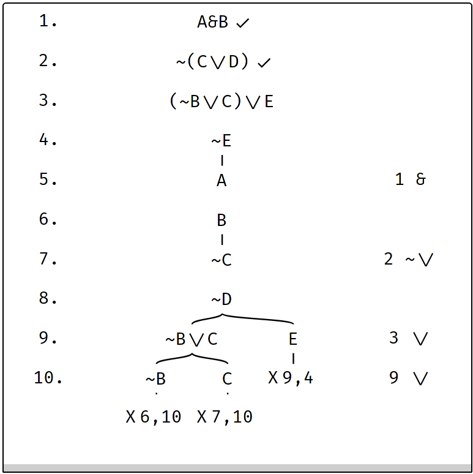

# Truth Trees (Semantic Tableaux)

Carnap supports making truth trees. A sample problem with one follows:

```{.TruthTree .Prop}
1.1 A&B,~(C\/D),(~B\/C)\/E,~E
```

Note that there is unfortunately [a bug](https://github.com/ubc-carnap-team/Rudolf/issues/114)
where long lines get cut off. When you begin solving the exercise, it will fix itself.

The source for this sample is this:
````
```{.TruthTree .Prop}
1.1 A&B,~(C\/D),(~B\/C)\/E,~E
```
````

Here is a screenshot of the solved version:



<details><summary>**Description of the above truth tree**</summary>

There's a downward continuation from line 4 with two lines, "A", line 5, and
"B", line 6, with "1" as the row and "&" as the rule in the right margin.

There's another with "~C", line 7, and "~D", line 8, following from row 2, with
rule "~\/".

There's a split branch on line 9 from line 3 into "~B∨C" and "E" with the rule
"\/". "E" on the right branch of line 9 is marked as a contradiction between
lines 9 and 4.

The left branch of line 9 further branches into "~B" and "C". "~B" is marked as
a contradiction between lines 6 and 10, and "C" is marked as a contradiction
between lines 7 and 10.

</details>

To solve it, the student should do the following:

1. Right click on line 1 ("A&B"), select "Continue branch with 2 formulas".
   Enter "A" as the first and "B" as the second. Row is 1, and rule is "&".
2. Right click on line 1, select "Mark as resolved" to put a checkmark on the line.
3. Right click on line 2 ("~(C∨D)"), select "Continue branch with 2
   formulas". Enter "~C" as the first, "~D" as the second. Row is 2, rule is
   "~\/".
4. Mark line 2 as resolved as above.
5. Right click on line 3, select "Split branch with 1 formula" and enter "~B∨C"
   in the left box and "E" in the right box. Row is 3, rule is "\/".
6. Right click the right branch "E" on line 9, select "Mark branch as
   contradiction" and enter "9,4" in the box.
7. Right click the left branch "~B∨C" and select "Split branch with 1 formula"
   and enter "~B" in the left box, "C" in the right box. Row is 9, rule is
   "\/".
8. Right click "~B" on line 10 to close it as a contradiction with line 6.
   Enter "6,10" in the box.
9. Right click "C" on line 10 to close it as a contradiction with line 7. Enter
   "7,10" in the box.
10. Mark line 3 as resolved.

## Setting another system

By default, truth trees operate on Ichikawa-Jenkins SL. You can change this to
something else using the `checkFunction` attribute (default value is
`"checkIchikawaJenkinsSLTableau"`).

For example,

````
```{.TruthTree .Prop checkFunction="checkIchikawaJenkinsQLTableau"}
1.1 P,P->Q,~Q
```
````
